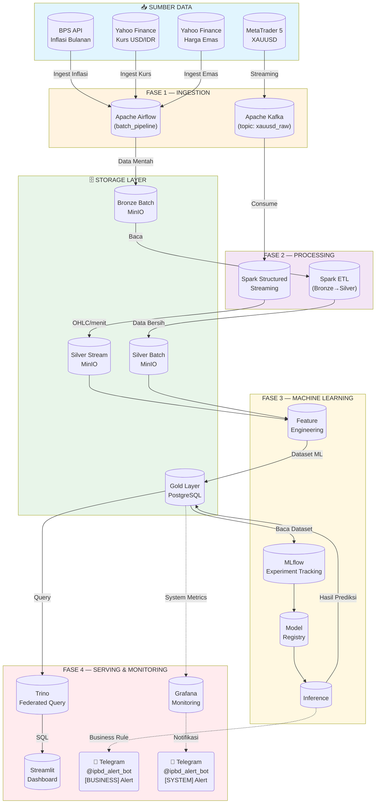

# Arsitektur Project IPBD — Gold Price Forecasting

## Teknologi yang Digunakan

| Layer | Teknologi | Versi |
|---|---|---|
| Orkestrasi Batch | Apache Airflow | 2.9.3 |
| Message Broker | Apache Kafka | 7.5.0 (cp-kafka) |
| Stream Processing | Apache Spark Structured Streaming | 3.5.3 |
| Batch Processing | Apache Spark | 3.5.3 |
| Object Storage | MinIO | latest |
| Relational Database | PostgreSQL | 15 |
| Federated Query | Trino | 434 |
| Experiment Tracking | MLflow | 2.10.2 |
| Dashboard | Streamlit | 1.28 |
| Monitoring | Grafana | latest |
| Alert | Telegram Bot | @ipbd_alert_bot |
| Programming | Python | 3.11 |

## Alur Data per Layer

| Layer | Storage | Deskripsi |
|---|---|---|
| **Bronze Batch** | MinIO `bronze-batch/` | Data mentah dari API BPS, Yahoo Finance |
| **Silver Batch** | MinIO `silver-batch/` | Data bersih: inflation_clean, exchange_rate_clean, gold_price_clean |
| **Silver Stream** | MinIO `silver-streaming/` | OHLC XAUUSD per menit |
| **Gold Layer** | PostgreSQL | Dataset integrasi + hasil prediksi |

## Author

**Vio & Najma** — Kelompok 10, IPBD 2026
